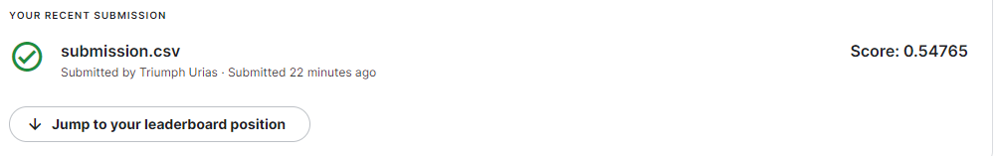

## Model1

This model is a Convolutional model and [GloVe](https://nlp.stanford.edu/projects/glove/) 100D vectors were used for the text embedding. The training and test data were extensively cleaned to remove hashtags, urls and to ensure all text are in lowercase so as to match the GloVe embedding texts.

An f1score of 0.54765 was attained on the final submission.

