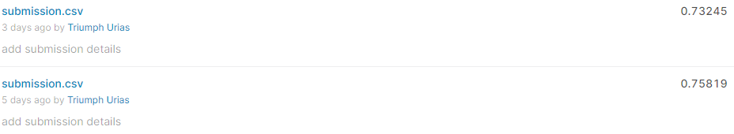

#Model3

For this I was interested in learning how to work with the Bidirectional Encoder Representations from Transformers (BERT) models and it's variations for handling NLP tasks.
I attained f1 scores of ~0.76 and ~0.73 using BERT and DistilBERT respectively.

